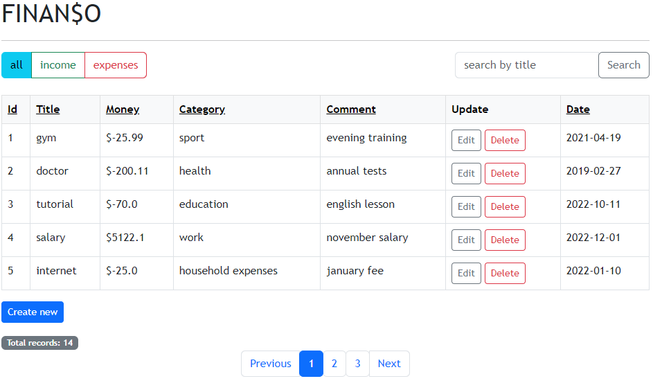
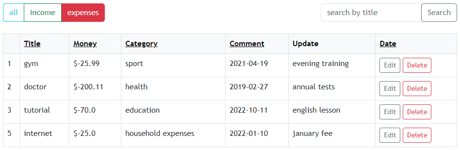
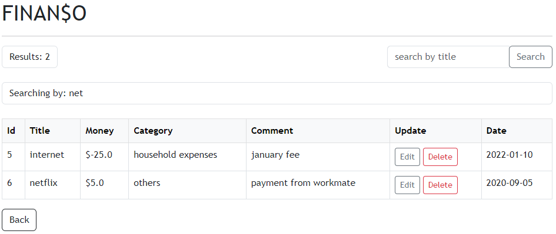
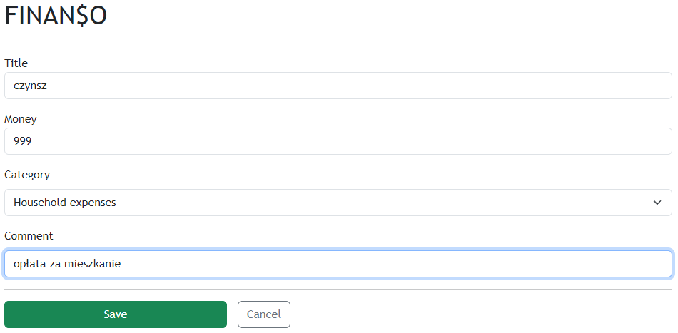
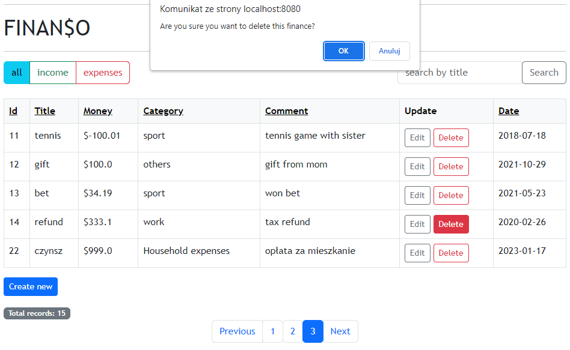

<h2 align="center">Finanso - Personal Finance Manager</h2>
A Java webapp to manage personal finances. It helps to keep track of any income and expenses.

## Tech/framework used 🔧
+ Java
+ Spring Boot
+ MySQL
+ Thymeleaf
+ Bootstrap

## Features ⚙️
+ Adding/Updating/Deleting finances
+ Pagination
+ Searching
+ Dividing finances by incomings and expenses
+ Sorting by columns
+ Form validation

## Screenshots 📺

### Main page:  

   
### Division by expenses and incomings:  

   
### Searching by title:  

   
### Adding new record to database:  

   
### Deleting existing record:  

